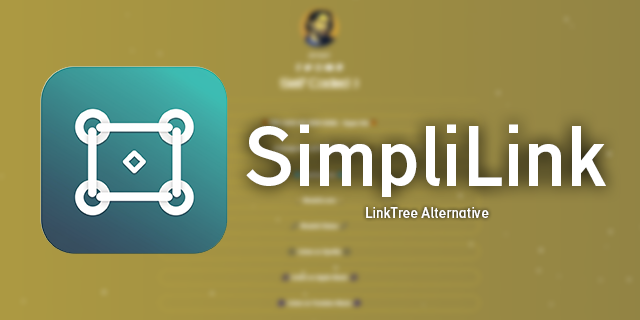
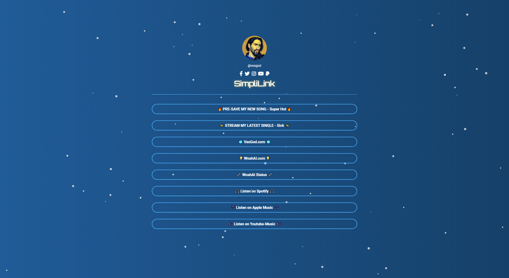

# SimpliLink

SimpliLink is a lightweight, user-friendly, and minimalistic alternative to Linktree that helps users consolidate multiple links into one easy-to-navigate platform. Showcase your online presence, including your content, projects, and social media profiles, all in one place.



## Features

- Clean and visually appealing interface
- Responsive design for a seamless experience across devices
- Easy setup and customization
- Personalized and professional profile page
- Showcase all your important links in one location



## Installation

1. Clone the repository or download the source code:

```bash
git clone https://github.com/Woahai321/SimpliLink-LinkTree-Clone.git
```

2. Open the `index.html` file in your favorite code editor and customize the content, links, and styles according to your preferences.

3. Save the modified `index.html`, `styles.css`, and `scripts.js` files, and upload them to your web server or a static site hosting platform (e.g., GitHub Pages, Netlify, Vercel).

4. Access your SimpliLink page using your domain or the URL provided by your hosting platform.

## Customization

- Update the profile image, name, and social media links in the `index.html` file.
- Modify the colors, fonts, and layout by editing the `styles.css` file.
- Add or remove links in the `<ul class="links">` section of the `index.html` file.

## Contributing

If you'd like to contribute to the SimpliLink project, feel free to fork the repository, make any changes or improvements, and submit a pull request. We appreciate your support!

## License

SimpliLink is open-source software licensed under the [MIT license](LICENSE).

[](https://vercel.com/import/git?s=https://github.com/Woahai321/SimpliLink-LinkTree-Clone)

